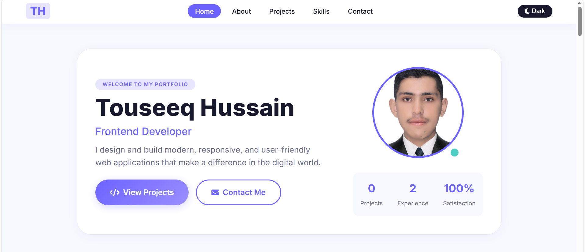
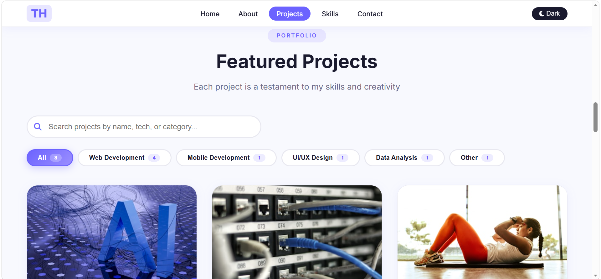

# Touseeq Hussain - Professional Portfolio

> A modern, responsive, and accessible portfolio website built with Vanilla JavaScript.

## Live Demo

[View Live Portfolio](https://github.com/touseeqHussain25/portfolio.git)

## Screenshots

### Home Section


### Projects Section


## Features

### Core Features
- **Dark/Light Theme** - Toggle with localStorage persistence
-  **Responsive Design** - Mobile-first approach
- **Accessibility** - ARIA labels, keyboard navigation, semantic HTML
-  **Performance Optimized** - Lazy loading, caching, minified assets

### Projects
-  **Search** - Search by title, technology, or category
-  **Filter** - Filter by category (All, Web, Mobile, Design, Data)
-  **Modal View** - Click project card for detailed view
-  **Featured Badges** - Highlight featured projects

### Skills
-  **Progress Bars** - Visual skill level indicators
-  **Icons** - Font Awesome icons for technologies
-  **Categories** - Languages, Frameworks, Tools

### Contact
-  **Contact Form** - With validation
-  **Toast Notifications** - Success/Error feedback
-  **Social Links** - GitHub, LinkedIn, Twitter

##  Technologies Used

### Frontend
- **HTML5** - Semantic markup
- **CSS3** - Custom properties, Flexbox, Grid
- **Vanilla JavaScript** - ES6+ features
- **Font Awesome** - Icons

### Tools
- **Vercel/Netlify** - Deployment
- **Git** - Version control
- **Chrome DevTools** - Performance testing

##  Installation

### Prerequisites
- Modern web browser
- Git (optional)

### Steps

1. **Clone the repository**
```bash
git clone https://github.com/touseeqHussain25/portfolio.git
cd portfolio